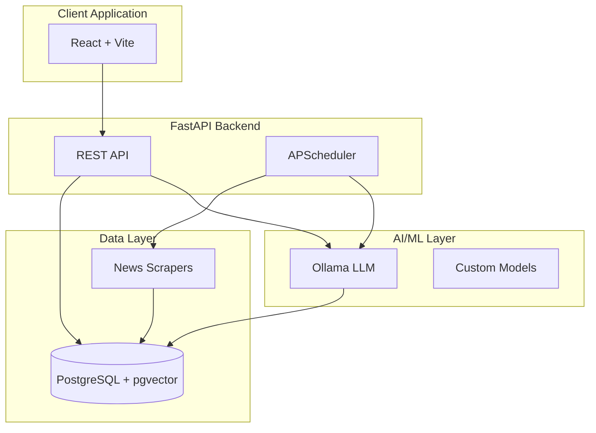

<p align="center">
  <h1 align="center">📰 Nuze</h1>
  <p align="center">
    <strong>AI-Powered Personalized News Aggregator</strong>
  </p>
  <p align="center">
    A full-stack application that collects news from multiple sources, synthesizes articles using LLM, and delivers a personalized news feed that learns from your preferences.
  </p>
</p>

---

## ✨ Features

- **🤖 AI-Synthesized Articles** — Combines multiple news sources into unified, balanced articles using local LLM
- **🎯 Personalized Feed** — Vector-based recommendation using pgvector similarity matching
- **📚 Preference Learning** — User preferences evolve based on interactions (likes/dislikes)
- **📝 Daily Summaries** — LLM-generated personalized news digests
- **🔐 JWT Authentication** — Secure user registration and login
- **📊 10 News Categories** — Politics, Economy, Science, Health, Education, Culture, Religion, Sports, World Affairs, Opinion

---

## 🏗️ Architecture



---

## 🛠️ Tech Stack

### Backend
| Technology | Purpose |
|------------|---------|
| **FastAPI** | REST API framework |
| **PostgreSQL + pgvector** | Database with vector similarity search |
| **SQLAlchemy 2.0** | Async ORM |
| **Ollama** | Local LLM inference |
| **APScheduler** | Background task scheduling |
| **Passlib + python-jose** | Authentication (bcrypt + JWT) |

### Frontend
| Technology | Purpose |
|------------|---------|
| **React 19** | UI framework |
| **Vite** | Build tool & dev server |
| **React Router** | Client-side routing |
| **Axios** | HTTP client |

### DevOps
| Technology | Purpose |
|------------|---------|
| **Docker Compose** | Container orchestration |
| **uv** | Python package management |
| **Pytest** | Testing framework |
| **Locust** | Load testing |

---

## 📁 Project Structure

```
nuze-backend/
├── app/                          # FastAPI application
│   ├── main.py                   # Application entrypoint
│   ├── database.py               # Database configuration
│   ├── models/                   # SQLAlchemy models
│   │   ├── user.py               # User entity
│   │   ├── article.py            # Raw article entity
│   │   ├── synthesized_article.py # AI-generated articles
│   │   ├── interaction.py        # User interactions
│   │   └── summary.py            # Daily summaries
│   ├── routers/                  # API endpoints
│   │   ├── auth.py               # /auth - Authentication
│   │   ├── users.py              # /me - User management
│   │   ├── feed.py               # /feed - Personalized feed
│   │   ├── summary.py            # /summary - Daily summaries
│   │   ├── feedback.py           # /feedback - Preference updates
│   │   ├── interactions.py       # /interactions - Like/dislike
│   │   └── ingestion.py          # /ingest - Manual triggers
│   ├── services/                 # Business logic
│   │   ├── nlp_service.py        # LLM integration
│   │   ├── feed_service.py       # Feed generation
│   │   ├── feedback_service.py   # Preference learning
│   │   ├── ingestion_service.py  # Article ingestion
│   │   ├── summary_service.py    # Summary generation
│   │   └── scheduler.py          # Background tasks
│   └── schemas/                  # Pydantic models
├── frontend/                     # React application
│   └── src/
│       ├── components/           # React components
│       │   ├── Article.jsx       # Article display
│       │   ├── DailySummary.jsx  # Summary view
│       │   ├── Onboarding.jsx    # Category selection
│       │   ├── Preferences.jsx   # Preference visualization
│       │   └── Profile.jsx       # User settings
│       └── api.js                # API client
├── scrapers/                     # News source scrapers
│   ├── new_bbc_scraper.py
│   ├── new_cnn_scraper.py
│   ├── new_foxnews_scraper.py
│   ├── new_nytimes_scraper.py
│   └── new_sky_news_scraper.py
├── scripts/
│   ├── init/                     # Initialization scripts
│   │   ├── init.sql              # Database extensions
│   │   ├── init_ollama.sh        # Ollama setup
│   │   └── ollama-models/        # Custom LLM models
│   ├── daily_cluster.py          # Article synthesis job
│   └── daily_ingest.py           # Article ingestion job
├── tests/                        # Test suites
├── docs/                         # Documentation
└── docker-compose.yml            # Container orchestration
```

---

## 🚀 Quick Start

### Prerequisites
- Docker & Docker Compose
- NVIDIA GPU (for Ollama, optional but recommended)

### 1. Clone & Start

```bash
git clone <repository-url>
cd nuze-backend
docker compose up -d
```

### 2. Access the Application

| Service | URL |
|---------|-----|
| Frontend | http://localhost:5173 |
| Backend API | http://localhost:8000 |
| API Docs | http://localhost:8000/docs |
| Ollama | http://localhost:11434 |

### 3. Initial Setup

On first run, the system will:
1. Initialize PostgreSQL with pgvector extension
2. Pull and configure Ollama models (phi4 base + custom models)
3. Create database tables via SQLAlchemy

---

## 🔄 Data Flow

### 1. Content Ingestion
```
News Sources → Scrapers → NLP Classification → Articles DB
```
Scheduled task scrapes articles from 5 news sources, classifies them into a 10-dimensional category vector using LLM.

### 2. Article Synthesis
```
Similar Articles → Clustering → LLM Synthesis → SynthesizedArticles DB
```
Daily job groups similar articles and generates balanced, unified articles.

### 3. Feed Generation
```
User Request → Vector Similarity (user preferences ↔ article categories) → Ranked Feed
```
Uses pgvector's cosine similarity to match user preferences with article category vectors.

### 4. Preference Learning
```
User Interaction → Feedback Service → Vector Update → User Preferences
```
Likes/dislikes adjust the user's 10-dimensional preference vector to improve future recommendations.

---

## 🧠 Custom LLM Models

Three custom Ollama models built on phi4:

| Model | Purpose |
|-------|---------|
| `news-classifier` | Classifies articles into 10 categories with confidence scores |
| `news-combiner` | Synthesizes multiple articles into a unified piece |
| `news-summarizer` | Generates personalized daily summaries |

---

## 📰 News Categories

The system uses 10 categories for article classification and user preferences:

1. Politics & Law
2. Economy & Business
3. Science & Technology
4. Health & Wellness
5. Education & Society
6. Culture & Entertainment
7. Religion & Belief
8. Sports
9. World & International Affairs
10. Opinion & General News

---

## 🧪 Testing

```bash
# Run all tests
uv run pytest

# Run with coverage
uv run pytest --cov=app

# Run specific test file
uv run pytest tests/unit/test_nlp_service.py
```

### Load Testing
```bash
cd tests/load
locust -f locustfile.py
```

---

## 📊 Evaluation

Generate offline evaluation metrics for the recommendation system:

```bash
python experiments/evaluation_report.py
```

Outputs `experiments/evaluation_report.md` with per-user and aggregate metrics.

---

## 🔧 Development

### Running Locally (without Docker)

```bash
# Backend
uv sync
uv run uvicorn app.main:app --reload

# Frontend
cd frontend
npm install
npm run dev
```

### Environment Variables

| Variable | Description | Default |
|----------|-------------|---------|
| `DATABASE_URL` | PostgreSQL connection string | `postgresql+asyncpg://...` |
| `OLLAMA_HOST` | Ollama server URL | `http://ollama:11434` |

---

## 📄 API Endpoints

| Method | Endpoint | Description |
|--------|----------|-------------|
| POST | `/auth/signup` | User registration |
| POST | `/auth/login` | User login (returns JWT) |
| GET | `/me` | Get current user profile |
| PUT | `/me` | Update user profile |
| POST | `/me/onboard` | Set initial preferences |
| GET | `/feed` | Get personalized article feed |
| GET | `/summary` | Get today's personalized summary |
| POST | `/interactions` | Record like/dislike |
| POST | `/ingest/run` | Trigger manual ingestion |

---

## 📚 Documentation

Detailed documentation is available in the `/docs` directory:

- [System Architecture](docs/system_architecture.md) — Full architecture diagrams
- [Components](docs/components.md) — Entity and service descriptions
- [ERD](docs/erd.md) — Database entity relationships
- [Data Flow](docs/data_flow.md) — Data pipeline diagrams

---

## 📜 License

This project is licensed under the terms specified in the [LICENSE](LICENSE) file.