# Nuze Backend - Complete System Class Diagram

This is a comprehensive class diagram of the Nuze Backend project, showing all models, schemas, services, and scrapers with their relationships.

## Layer-Specific Diagrams

- [Data Layer (Models)](./class_diagram_data_layer.md)
- [API Layer (Schemas)](./class_diagram_api_layer.md)
- [Business Logic Layer (Services)](./class_diagram_business_layer.md)
- [External Integration Layer (Scrapers & Utilities)](./class_diagram_external_layer.md)

```mermaid
classDiagram
    direction TB

    %% ==========================================
    %% DATABASE MODELS (SQLAlchemy)
    %% ==========================================
    
    class Base {
        <<SQLAlchemy Base>>
    }

    class Article {
        +UUID id
        +String title
        +Text content
        +String source_url
        +String image_url
        +String publisher
        +DateTime published_at
        +String language
        +DateTime scraped_at
        +Vector~10~ category_scores
        +JSONB metadata_
    }

    class User {
        +UUID id
        +String email
        +String hashed_password
        +String name
        +Vector~10~ preferences
        +JSONB preferences_metadata
        +DateTime created_at
    }

    class UserInteraction {
        +UUID id
        +UUID user_id
        +UUID synthesized_article_id
        +Boolean is_liked
        +DateTime created_at
    }

    class DailySummary {
        +UUID id
        +UUID user_id
        +Array~UUID~ article_ids
        +DateTime summary_generated_at
        +Date date
        +JSONB summary_text
    }

    class SynthesizedArticle {
        +UUID id
        +String title
        +Text content
        +String image_url
        +DateTime generated_at
        +Text generation_prompt
        +Text notes
        +JSONB analysis
        +Vector~10~ category_scores
        +JSONB metadata_scores
        +published_at() DateTime
        +publisher() String
        +sources_detail() List
    }

    class SynthesizedSource {
        +UUID synthesized_id
        +UUID article_id
    }

    %% Model Inheritance
    Base <|-- Article
    Base <|-- User
    Base <|-- UserInteraction
    Base <|-- DailySummary
    Base <|-- SynthesizedArticle
    Base <|-- SynthesizedSource

    %% Model Relationships
    User "1" --> "*" UserInteraction : has
    User "1" --> "*" DailySummary : has
    SynthesizedArticle "1" --> "*" UserInteraction : receives
    SynthesizedArticle "1" --> "*" SynthesizedSource : has sources
    Article "1" --> "*" SynthesizedSource : is source of

    %% ==========================================
    %% PYDANTIC SCHEMAS
    %% ==========================================

    class BaseModel {
        <<Pydantic>>
    }

    class SourceDetail {
        +Optional~str~ title
        +Optional~str~ url
        +Optional~str~ publisher
    }

    class ArticleResponse {
        +Any id
        +str title
        +str content
        +Optional~str~ source_url
        +Optional~str~ publisher
        +Optional~datetime~ published_at
        +Optional~str~ image_url
        +Optional~str~ language
        +Optional~List~float~~ category_scores
        +List~SourceDetail~ sources
        +Optional~bool~ is_liked
        +author() Optional~str~
        +published_at_field() Optional~datetime~
    }

    class UserBase {
        +EmailStr email
    }

    class UserCreate {
        +str password
        +Optional~str~ name
    }

    class UserLogin {
        +str password
    }

    class Token {
        +str access_token
        +str token_type
        +UUID user_id
    }

    class UserResponse {
        +UUID id
        +Optional~str~ name
        +bool is_onboarded
    }

    class UserOnboarding {
        +int age
        +str gender
        +str location
        +List~str~ preferences
    }

    class UserPasswordUpdate {
        +str current_password
        +str new_password
    }

    class PreferencesUpdate {
        +Optional~List~float~~ interests_vector
        +Optional~dict~ metadata
    }

    class PreferencesResponse {
        +List~float~ interests_vector
        +Optional~dict~ metadata
    }

    %% Schema Inheritance
    BaseModel <|-- SourceDetail
    BaseModel <|-- ArticleResponse
    BaseModel <|-- UserBase
    BaseModel <|-- Token
    BaseModel <|-- UserOnboarding
    BaseModel <|-- UserPasswordUpdate
    BaseModel <|-- PreferencesUpdate
    BaseModel <|-- PreferencesResponse
    UserBase <|-- UserCreate
    UserBase <|-- UserLogin
    UserBase <|-- UserResponse

    %% Schema Relationships
    ArticleResponse "1" --> "*" SourceDetail : contains

    %% ==========================================
    %% SERVICES
    %% ==========================================

    class AuthService {
        -AsyncSession db
        +__init__(db: AsyncSession)
        +create_user(user_in: UserCreate) User
        +authenticate_user(user_in: UserLogin) User
    }

    class UserService {
        -AsyncSession db
        +__init__(db: AsyncSession)
        +get_user_preferences(user_id) tuple
        +update_user_preferences(user_id, preferences, metadata) List~float~
        +initialize_user_vector(user_id, onboarding_data)
        +get_read_articles(user_id, limit, skip) List
    }

    class FeedService {
        -AsyncSession db
        -UserService user_service
        +__init__(db: AsyncSession)
        +get_personalized_feed(user_id, limit, skip) List~SynthesizedArticle~
        +get_top_articles(user_id, limit) List~Article~
    }

    class FeedbackService {
        -AsyncSession db
        -UserService user_service
        -float read_lr_ratio
        +__init__(db: AsyncSession)
        +record_feedback(user_id, article_id, is_liked) UserInteraction
        +update_preferences_from_article(user_id, article_id, is_liked, article_obj)
        -_get_metadata_vector(meta_dict) ndarray
        -_get_metadata_dict(meta_vec) dict
        -_rescale_and_normalize_vector(vector, target_sum) ndarray
        -_calculate_update(user_vec, article_vec, is_liked, learning_rate) ndarray
    }

    class SummaryService {
        -AsyncSession db
        -FeedService feed_service
        -NLPService nlp_service
        +__init__(db: AsyncSession)
        +get_daily_summary(user_id) Optional~DailySummary~
        +generate_daily_summary(user_id) DailySummary
    }

    class NLPService {
        -AsyncClient client
        -str model_name
        +__init__(model_name, host)
        +classify_article(text) List~float~
        +summarize_articles(articles_text, user_preferences) str
    }

    class ContentService {
        -AsyncSession db
        -NLPService nlp_service
        +__init__(db: AsyncSession)
        +ingest_article(title, content, source_url, publisher) Article
        +get_recent_articles(limit) List~Article~
    }

    class IngestionService {
        +str OLLAMA_HOST
        +str MODEL_NAME
        +str PROMPT_TEMPLATE
        -Client client
        -List scrapers
        +__init__()
        +run_daily_ingestion(dry_run)
        +process_article(article_data, dry_run)
        -_call_ollama(text) dict
        -_parse_ollama_json(raw_response) dict
        -_extract_category_scores(result) List~float~
    }

    %% Service Dependencies
    FeedService --> UserService : uses
    FeedbackService --> UserService : uses
    SummaryService --> FeedService : uses
    SummaryService --> NLPService : uses
    ContentService --> NLPService : uses

    %% Service-Model Dependencies
    AuthService ..> User : manages
    UserService ..> User : manages
    FeedService ..> SynthesizedArticle : queries
    FeedService ..> Article : queries
    FeedbackService ..> UserInteraction : manages
    FeedbackService ..> SynthesizedArticle : queries
    SummaryService ..> DailySummary : manages
    ContentService ..> Article : manages
    IngestionService ..> Article : creates

    %% ==========================================
    %% SCRAPERS
    %% ==========================================

    class BaseScraper {
        <<abstract>>
        +__init__()
        +scrape()* List~Dict~
        +compute_hash(text) str
    }

    class BBCScraper {
        +str BASE_URL
        +List CATEGORIES
        +scrape() List~Dict~
        -_fetch_category_urls(session, category) List
        -_fetch_article(session, url) Dict
        -_make_absolute(href) str
    }

    class CNNScraper {
        +str BASE_URL
        +List CATEGORIES
        +scrape() List~Dict~
        -_fetch_category_urls(session, category) List
        -_fetch_article(session, url) Dict
    }

    class FoxNewsScraper {
        +str BASE_URL
        +List CATEGORIES
        +scrape() List~Dict~
        -_fetch_category_urls(session, category) List
        -_fetch_article(session, url) Dict
    }

    class NYTimesScraper {
        +str BASE_URL
        +List CATEGORIES
        +scrape() List~Dict~
        -_fetch_category_urls(session, category) List
        -_fetch_article(session, url) Dict
    }

    class SkyNewsScraper {
        +str BASE_URL
        +List CATEGORIES
        +scrape() List~Dict~
        -_fetch_category_urls(session, category) List
        -_fetch_article(session, url) Dict
    }

    %% Scraper Inheritance
    BaseScraper <|-- BBCScraper
    BaseScraper <|-- CNNScraper
    BaseScraper <|-- FoxNewsScraper
    BaseScraper <|-- NYTimesScraper
    BaseScraper <|-- SkyNewsScraper

    %% Ingestion uses Scrapers
    IngestionService "1" --> "*" BaseScraper : uses

    %% ==========================================
    %% UTILITIES & SCHEDULER
    %% ==========================================

    class Scheduler {
        <<module>>
        +AsyncIOScheduler scheduler
        +run_daily_cluster()
        +run_daily_ingest()
        +start_scheduler()
    }

    class LLMValidator {
        <<module>>
        +List CATEGORIES
        +List METADATA_KEYS
        +List ALLOWED_CONTENT_TYPES
        +List TONE_KEYS
        +validate_output(result) tuple~bool, str~
    }

    %% Scheduler Dependencies
    Scheduler --> SummaryService : triggers
    IngestionService --> LLMValidator : uses
```

## Diagram Legend

| Symbol | Meaning |
|--------|---------|
| `<<abstract>>` | Abstract class (cannot be instantiated) |
| `<<SQLAlchemy Base>>` | SQLAlchemy declarative base |
| `<<Pydantic>>` | Pydantic BaseModel |
| `<<module>>` | Python module (not a class) |
| `+` | Public method/attribute |
| `-` | Private method/attribute |
| `-->` | Association/Dependency |
| `..>` | Uses/Manages relationship |
| `<\|--` | Inheritance |
| `"1" --> "*"` | One-to-many relationship |

## Architecture Overview

### Data Layer
- **SQLAlchemy Models**: `Article`, `User`, `UserInteraction`, `DailySummary`, `SynthesizedArticle`, `SynthesizedSource`
- Vector columns use `pgvector` for similarity searches

### API Layer  
- **Pydantic Schemas**: Request/Response validation models for the FastAPI endpoints

### Business Logic Layer
- **Services**: Core business logic including authentication, feed generation, feedback processing, and summarization

### External Integration Layer
- **Scrapers**: Web scrapers for news sources (BBC, CNN, Fox News, NY Times, Sky News)
- **NLP Service**: Ollama integration for article classification and summarization
- **Scheduler**: APScheduler for daily jobs
