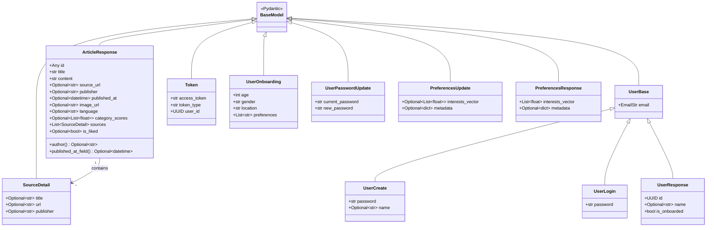

# API Layer - Pydantic Schemas

```mermaid
classDiagram
    direction TB

    class BaseModel {
        <<Pydantic>>
    }

    class SourceDetail {
        +Optional~str~ title
        +Optional~str~ url
        +Optional~str~ publisher
    }

    class ArticleResponse {
        +Any id
        +str title
        +str content
        +Optional~str~ source_url
        +Optional~str~ publisher
        +Optional~datetime~ published_at
        +Optional~str~ image_url
        +Optional~str~ language
        +Optional~List~float~~ category_scores
        +List~SourceDetail~ sources
        +Optional~bool~ is_liked
        +author() Optional~str~
        +published_at_field() Optional~datetime~
    }

    class UserBase {
        +EmailStr email
    }

    class UserCreate {
        +str password
        +Optional~str~ name
    }

    class UserLogin {
        +str password
    }

    class Token {
        +str access_token
        +str token_type
        +UUID user_id
    }

    class UserResponse {
        +UUID id
        +Optional~str~ name
        +bool is_onboarded
    }

    class UserOnboarding {
        +int age
        +str gender
        +str location
        +List~str~ preferences
    }

    class UserPasswordUpdate {
        +str current_password
        +str new_password
    }

    class PreferencesUpdate {
        +Optional~List~float~~ interests_vector
        +Optional~dict~ metadata
    }

    class PreferencesResponse {
        +List~float~ interests_vector
        +Optional~dict~ metadata
    }

    %% Inheritance
    BaseModel <|-- SourceDetail
    BaseModel <|-- ArticleResponse
    BaseModel <|-- UserBase
    BaseModel <|-- Token
    BaseModel <|-- UserOnboarding
    BaseModel <|-- UserPasswordUpdate
    BaseModel <|-- PreferencesUpdate
    BaseModel <|-- PreferencesResponse
    UserBase <|-- UserCreate
    UserBase <|-- UserLogin
    UserBase <|-- UserResponse

    %% Relationships
    ArticleResponse "1" --> "*" SourceDetail : contains
```
