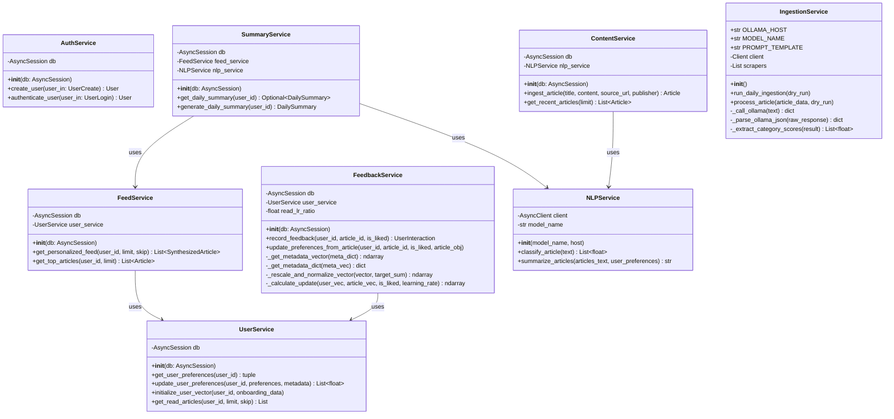

# Business Logic Layer - Services

```mermaid
classDiagram
    direction TB

    class AuthService {
        -AsyncSession db
        +__init__(db: AsyncSession)
        +create_user(user_in: UserCreate) User
        +authenticate_user(user_in: UserLogin) User
    }

    class UserService {
        -AsyncSession db
        +__init__(db: AsyncSession)
        +get_user_preferences(user_id) tuple
        +update_user_preferences(user_id, preferences, metadata) List~float~
        +initialize_user_vector(user_id, onboarding_data)
        +get_read_articles(user_id, limit, skip) List
    }

    class FeedService {
        -AsyncSession db
        -UserService user_service
        +__init__(db: AsyncSession)
        +get_personalized_feed(user_id, limit, skip) List~SynthesizedArticle~
        +get_top_articles(user_id, limit) List~Article~
    }

    class FeedbackService {
        -AsyncSession db
        -UserService user_service
        -float read_lr_ratio
        +__init__(db: AsyncSession)
        +record_feedback(user_id, article_id, is_liked) UserInteraction
        +update_preferences_from_article(user_id, article_id, is_liked, article_obj)
        -_get_metadata_vector(meta_dict) ndarray
        -_get_metadata_dict(meta_vec) dict
        -_rescale_and_normalize_vector(vector, target_sum) ndarray
        -_calculate_update(user_vec, article_vec, is_liked, learning_rate) ndarray
    }

    class SummaryService {
        -AsyncSession db
        -FeedService feed_service
        -NLPService nlp_service
        +__init__(db: AsyncSession)
        +get_daily_summary(user_id) Optional~DailySummary~
        +generate_daily_summary(user_id) DailySummary
    }

    class NLPService {
        -AsyncClient client
        -str model_name
        +__init__(model_name, host)
        +classify_article(text) List~float~
        +summarize_articles(articles_text, user_preferences) str
    }

    class ContentService {
        -AsyncSession db
        -NLPService nlp_service
        +__init__(db: AsyncSession)
        +ingest_article(title, content, source_url, publisher) Article
        +get_recent_articles(limit) List~Article~
    }

    class IngestionService {
        +str OLLAMA_HOST
        +str MODEL_NAME
        +str PROMPT_TEMPLATE
        -Client client
        -List scrapers
        +__init__()
        +run_daily_ingestion(dry_run)
        +process_article(article_data, dry_run)
        -_call_ollama(text) dict
        -_parse_ollama_json(raw_response) dict
        -_extract_category_scores(result) List~float~
    }

    %% Dependencies
    FeedService --> UserService : uses
    FeedbackService --> UserService : uses
    SummaryService --> FeedService : uses
    SummaryService --> NLPService : uses
    ContentService --> NLPService : uses
```
