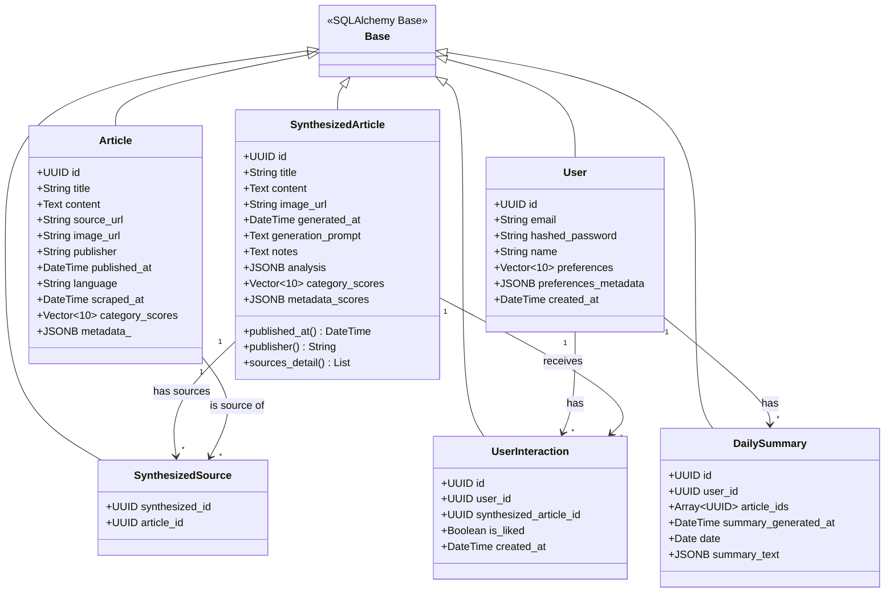

# Data Layer - SQLAlchemy Models

```mermaid
classDiagram
    direction TB

    class Base {
        <<SQLAlchemy Base>>
    }

    class Article {
        +UUID id
        +String title
        +Text content
        +String source_url
        +String image_url
        +String publisher
        +DateTime published_at
        +String language
        +DateTime scraped_at
        +Vector~10~ category_scores
        +JSONB metadata_
    }

    class User {
        +UUID id
        +String email
        +String hashed_password
        +String name
        +Vector~10~ preferences
        +JSONB preferences_metadata
        +DateTime created_at
    }

    class UserInteraction {
        +UUID id
        +UUID user_id
        +UUID synthesized_article_id
        +Boolean is_liked
        +DateTime created_at
    }

    class DailySummary {
        +UUID id
        +UUID user_id
        +Array~UUID~ article_ids
        +DateTime summary_generated_at
        +Date date
        +JSONB summary_text
    }

    class SynthesizedArticle {
        +UUID id
        +String title
        +Text content
        +String image_url
        +DateTime generated_at
        +Text generation_prompt
        +Text notes
        +JSONB analysis
        +Vector~10~ category_scores
        +JSONB metadata_scores
        +published_at() DateTime
        +publisher() String
        +sources_detail() List
    }

    class SynthesizedSource {
        +UUID synthesized_id
        +UUID article_id
    }

    %% Inheritance
    Base <|-- Article
    Base <|-- User
    Base <|-- UserInteraction
    Base <|-- DailySummary
    Base <|-- SynthesizedArticle
    Base <|-- SynthesizedSource

    %% Relationships
    User "1" --> "*" UserInteraction : has
    User "1" --> "*" DailySummary : has
    SynthesizedArticle "1" --> "*" UserInteraction : receives
    SynthesizedArticle "1" --> "*" SynthesizedSource : has sources
    Article "1" --> "*" SynthesizedSource : is source of
```
