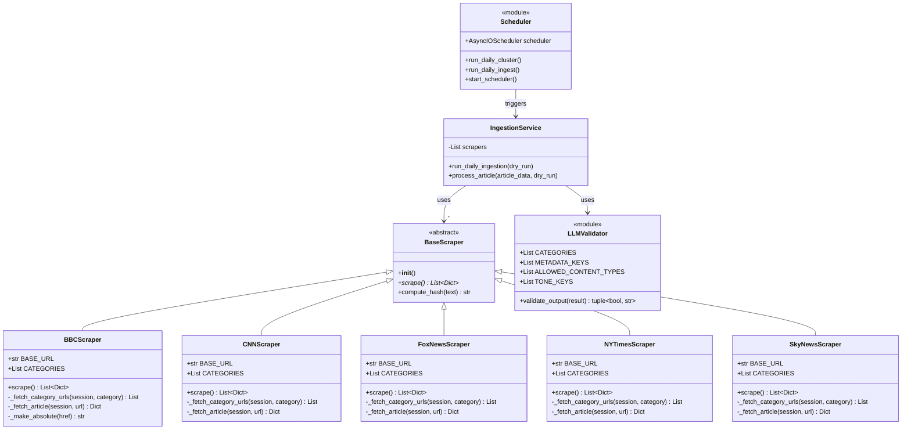

# External Integration Layer - Scrapers & Utilities

```mermaid
classDiagram
    direction TB

    %% ==========================================
    %% SCRAPERS
    %% ==========================================

    class BaseScraper {
        <<abstract>>
        +__init__()
        +scrape()* List~Dict~
        +compute_hash(text) str
    }

    class BBCScraper {
        +str BASE_URL
        +List CATEGORIES
        +scrape() List~Dict~
        -_fetch_category_urls(session, category) List
        -_fetch_article(session, url) Dict
        -_make_absolute(href) str
    }

    class CNNScraper {
        +str BASE_URL
        +List CATEGORIES
        +scrape() List~Dict~
        -_fetch_category_urls(session, category) List
        -_fetch_article(session, url) Dict
    }

    class FoxNewsScraper {
        +str BASE_URL
        +List CATEGORIES
        +scrape() List~Dict~
        -_fetch_category_urls(session, category) List
        -_fetch_article(session, url) Dict
    }

    class NYTimesScraper {
        +str BASE_URL
        +List CATEGORIES
        +scrape() List~Dict~
        -_fetch_category_urls(session, category) List
        -_fetch_article(session, url) Dict
    }

    class SkyNewsScraper {
        +str BASE_URL
        +List CATEGORIES
        +scrape() List~Dict~
        -_fetch_category_urls(session, category) List
        -_fetch_article(session, url) Dict
    }

    %% Scraper Inheritance
    BaseScraper <|-- BBCScraper
    BaseScraper <|-- CNNScraper
    BaseScraper <|-- FoxNewsScraper
    BaseScraper <|-- NYTimesScraper
    BaseScraper <|-- SkyNewsScraper

    %% ==========================================
    %% UTILITIES
    %% ==========================================

    class Scheduler {
        <<module>>
        +AsyncIOScheduler scheduler
        +run_daily_cluster()
        +run_daily_ingest()
        +start_scheduler()
    }

    class LLMValidator {
        <<module>>
        +List CATEGORIES
        +List METADATA_KEYS
        +List ALLOWED_CONTENT_TYPES
        +List TONE_KEYS
        +validate_output(result) tuple~bool, str~
    }

    class IngestionService {
        -List scrapers
        +run_daily_ingestion(dry_run)
        +process_article(article_data, dry_run)
    }

    %% Relationships
    IngestionService "1" --> "*" BaseScraper : uses
    IngestionService --> LLMValidator : uses
    Scheduler --> IngestionService : triggers
```
