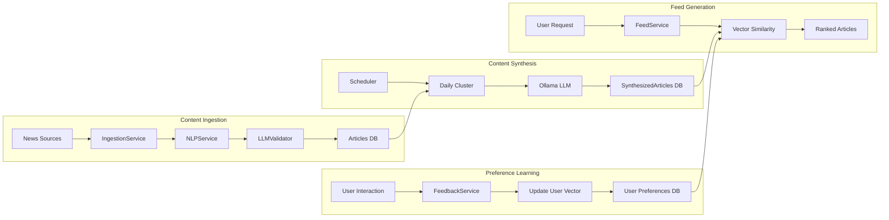

# Nuze Data Flow Diagram

## Data Flow

```mermaid
flowchart LR
    subgraph Ingestion["Content Ingestion"]
        A1["News Sources"] --> A2["IngestionService"]
        A2 --> A3["NLPService"]
        A3 --> A4["LLMValidator"]
        A4 --> A5["Articles DB"]
    end

    subgraph Synthesis["Content Synthesis"]
        B1["Scheduler"] --> B2["Daily Cluster"]
        B2 --> B3["Ollama LLM"]
        B3 --> B4["SynthesizedArticles DB"]
    end

    subgraph Feed["Feed Generation"]
        C1["User Request"] --> C2["FeedService"]
        C2 --> C3["Vector Similarity"]
        C3 --> C4["Ranked Articles"]
    end

    subgraph Learning["Preference Learning"]
        D1["User Interaction"] --> D2["FeedbackService"]
        D2 --> D3["Update User Vector"]
        D3 --> D4["User Preferences DB"]
    end

    A5 --> B2
    B4 --> C3
    D4 --> C3
```
