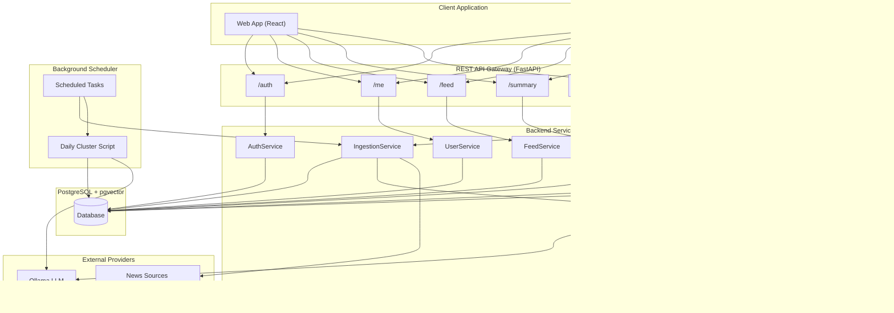

# Nuze System Architecture

---

## System Architecture Diagram

---

## Entity Relationship Diagram (ERD)

---

## Data Flow Diagram

---

## Entities

### User
**Fields:** id, email, hashed_password, name, preferences (Vector), preferences_metadata (JSON), created_at.

**Responsibility:** Store user identity, authentication credentials, and personalization data, including a multi-dimensional preferences vector and related metadata.

### Article
**Fields:** id, title, content, source_url, image_url, publisher, published_at, language, scraped_at, category_scores (Vector), metadata (JSON).

**Responsibility:** Represent an original news article collected from an external source, including its full textual content and NLP-generated category scores.

### SynthesizedArticle
**Fields:** id, title, content, image_url, generated_at, generation_prompt, notes, analysis (JSON), category_scores (Vector), metadata_scores (JSON).

**Responsibility:** Represent AI-generated content synthesized from multiple source articles and used as the main content object delivered to users.

### SynthesizedSource
**Fields:** synthesized_id (FK), article_id (FK).

**Responsibility:** Maintain a many-to-many relationship between synthesized articles and their original source articles, enabling content traceability.

### DailySummary
**Fields:** id, user_id (FK), article_ids (ARRAY), date, summary_generated_at, summary_text (JSON).

**Responsibility:** Store personalized daily summaries per user, including the articles involved and the generated summary content.

### UserInteraction
**Fields:** id, user_id (FK), synthesized_article_id (FK), is_liked, created_at.

**Constraints:** UniqueConstraint on (user_id, synthesized_article_id).

**Responsibility:** Track user interactions with synthesized content to support personalization, learning mechanisms, and analytics.

---

## Boundaries

### Client Application (Web / Mobile)
**Responsibilities:** User registration and login, display of AI-processed content, profile and preference management, and submission of user feedback.
**Communication:** REST/HTTPS communication with the backend system.

### REST API Gateway (FastAPI)
**Responsibilities:** Handle all external HTTP requests (authentication, feed retrieval, summaries, feedback), perform input validation and JSON parsing, manage JWT-based authentication and authorization, and route requests to the appropriate controllers.

### Scheduler
**Responsibilities:** Trigger time-based background processes such as daily article ingestion, classification, and AI-based synthesized article generation.
**Communication:** Internal invocation of backend services based on scheduled execution.

### External Data Providers
**Responsibilities:** Provide raw news articles via web scraping mechanisms and perform NLP processing (classification and summarization) using external AI services (Ollama LLM).
**Communication:** Accessed through HTTP-based APIs.

---

## Controls

### AuthController / AuthService
**Boundaries:** REST API, Client Application.
**Entities:** User.
**Responsibilities:** Handle user signup and login, verify credentials, and generate secure JWT access tokens.

### UserController / UserService
**Boundaries:** REST API.
**Entities:** User, UserInteraction, SynthesizedArticle.
**Responsibilities:** Manage user onboarding, profile data, preference updates, and reading history.

### FeedController / FeedService
**Boundaries:** REST API.
**Entities:** User, SynthesizedArticle, UserInteraction.
**Responsibilities:** Generate a personalized news feed using similarity calculations between user preference vectors and content category vectors.

### SummaryController / SummaryService
**Boundaries:** REST API.
**Entities:** DailySummary, Article.
**Responsibilities:** Generate and persist daily personalized summaries using NLP-based processing.

### ContentIngestionController / IngestionService
**Boundaries:** External Data Providers, Scheduler.
**Entities:** Article.
**Responsibilities:** Periodically collect articles from external sources, classify them using NLP services, and store them in the database.

### FeedbackController / FeedbackService
**Boundaries:** Client Application.
**Entities:** UserInteraction, User, SynthesizedArticle.
**Responsibilities:** Receive user feedback and update personalization data to improve future recommendations.

### InteractionsController
**Boundaries:** REST API, Client Application.
**Entities:** UserInteraction, User, SynthesizedArticle.
**Responsibilities:** Record user interactions (like, dislike, click) with synthesized articles and delegate to FeedbackService for preference updates.

### ContentService
**Boundaries:** Internal.
**Entities:** Article.
**Responsibilities:** Wrapper service for article ingestion with NLP classification, retrieve recent articles.

### NLPService
**Boundaries:** External Data Providers (Ollama).
**Entities:** Article, SynthesizedArticle.
**Responsibilities:** Classify articles into 10-dimensional category vectors using LLM.

### LLMValidator
**Boundaries:** Internal.
**Entities:** None (utility service).
**Responsibilities:** Validate LLM classification outputs, ensure category scores sum to 5.0, normalize rounding errors, and validate metadata structure.
