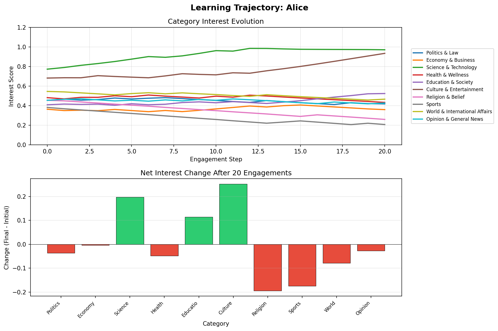
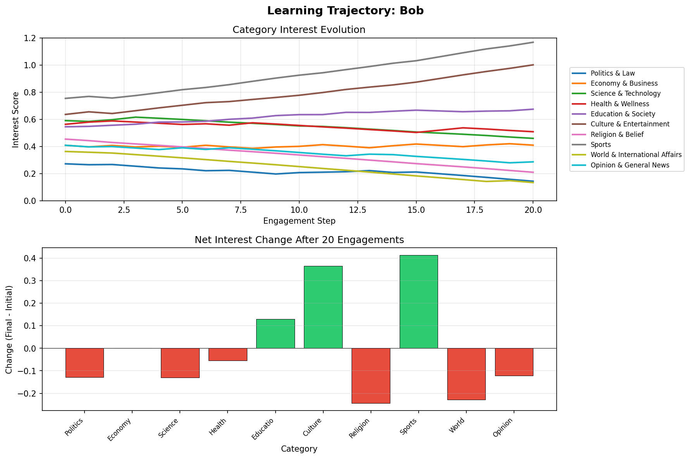
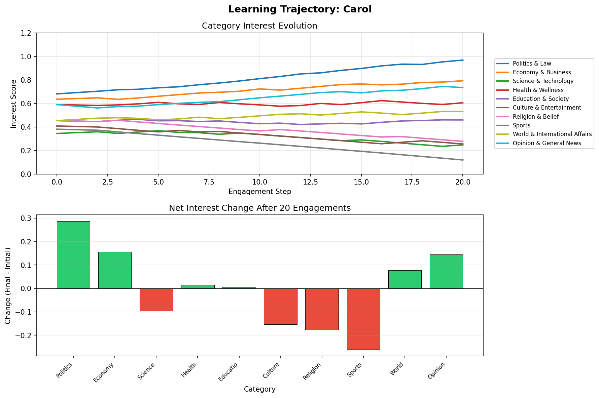

# Evaluation Metrics Report

These metrics are computed from the sample users and synthesized article vectors loaded from database (synthesized_articles).
Article count used for scoring: 129 synthesized items.

## What the numbers mean
- **Ranking quality snapshot**: Top-20 lists average 0.63 precision and 0.63 recall based on category-matched engagements.
- **Engagement coverage**: 3 of 3 users record non-zero relevance.
- **Updates are small and aligned**: Average L2 update steps are 0.0415 with 0.558 directionality agreement, showing the median-ratio updates mostly move in the same sign as article deviations.
- **Catalog breadth**: Top-20 recommendations touch 4.33 of 10 categories on average, so exploration remains concentrated.

## Overall summary
- Mean Precision@20: 0.633
- Mean Recall@20: 0.633
- Mean nDCG@20: 0.885
- Mean weighted engagement@20: 0.633 (click weight=0.25)
- Avg update L2 norm: 0.0415
- Avg directionality agreement: 0.558
- Category coverage@20: 4.33 of 10

## Per-user breakdown
| User | Precision@K | Recall@K | nDCG@K | Weighted@K | Coverage@K | Avg Δ‖ · ‖ | Directionality |
| --- | --- | --- | --- | --- | --- | --- | --- |
| Alice | 0.500 | 0.500 | 0.932 | 0.500 | 4 | 0.0407 | 0.495 |
| Bob | 0.550 | 0.550 | 0.727 | 0.550 | 5 | 0.0427 | 0.460 |
| Carol | 0.850 | 0.850 | 0.996 | 0.850 | 4 | 0.0411 | 0.720 |

## Learning Trajectory Visualizations

The following charts show how each user's interest vector evolves through their engagement history:

### Alice

### Bob

### Carol

